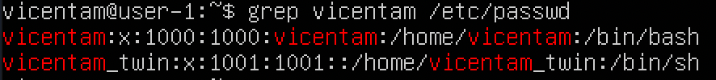
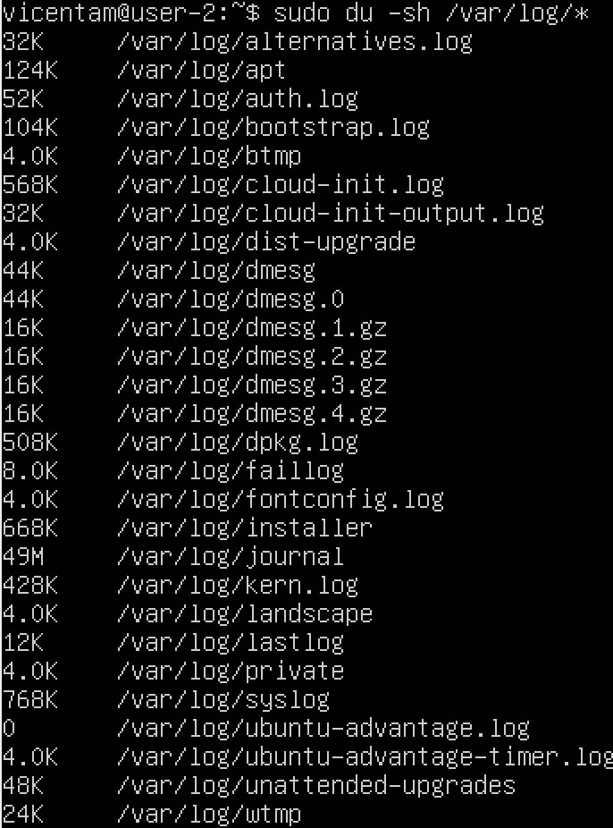
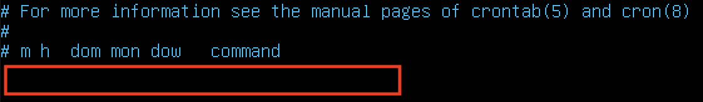

## Part 1. Установка ОС

- Определяем версию Ubuntu, выполнив команду: `cat /etc/issue`

***
## Part 2. Создание пользователя

- Создаем пользователя с помощью команды `sudo useradd <username>`

- Добавляем новосозданного пользователя в группу с помощью команды: `sudo usermod -a -G <group_name> <username>` 
- Удостоверяемся, что пользователь сущетсвует: `grep "vicentam" /etc/passwd `

***
## Part 3. Настройка сети ОС

- Меняем название машины через текстовый редактор `vim: sudo vi /etc/hostname` и проверяем, внеслись ли изменения: `hostnamectl`. Перезагружаем систему: `sudo reboot`.

- Устанавливаем временную зону, соответствующую текущему местоположению: 
    1.  Выводим список временных зон: `timedatectl list-timezones` и находим нужную зону. В нашем случае это Europe/Moscow
    2.  С помощью команды sudo `timedatectl set-timezone Europe/Moscow` назначаем нужную зону.
    3. Выводим системные настройки даты/времени:  `timedatectl`

- Названия сетевых интерфейсов с пмощью консольной команды `ifconfig`, предустановленного пакета net-tools:

 > Интерфейс lo (loopback interface) -- особый сетевой интерфейс, который используется системой для коммуникации с самой собой. Он используется в основном для диагностики и устранения неполадок, а также для подключения к серверам, работающим на локальном компьютере. 

- 
 >DHCP (Dynamic Host Configuration Protocol, рус. Протокол динамической настройки узла) -- протокол, в автоматическом режиме назначающий устройствам, подключающимся к сети, сетевым устройствам, IP-адреса.

- Получаем нужные нам ip-адреса. Внешний ip-адрес шлюза 192.186.50.130 и внутренний IP-адрес шлюза 10.0.2.15

 

- Программа cloud-init при инициализации виртуальной машины Linux активирует динамическое присвоение ip-адреса, поэтому необходимо убедиться, что cloud-init отключён.  Открываем файл: `/etc/cloud/cloud.cfg.d/subiquity-disable-cloudinit-networking.cfg` ,  находим строчку `network: {config: disabled}`.  Если её нет - добавляем вручную.  Открываем для редактрования файл с сетевыми настройками  `sudo vi /etc/netplan/00-installer-config.yaml` Применяем наши настройки `sudo netplan apply`

- Перезагружаем машину `sudo reboot` и убеждаемся, то настройки сохранились: 

Пробуем пропинговать удалённые хосты: 

***
## Part 4. Обновление ОС

- Запускаем команду `sudo apt upgrade`
- Повторно запускаем команду ` sudo apt upgrade`, чтобы убедиться, что обновления отсутствуют.

***
## Part 5. Использование команды sudo 

>**sudo (su**peruser **do)** -- утилита, которая позволяет пользователю в случае необходимости выполнять команды от имени суперпользователя (root-пользователя). Например, запуск программ, требующих повышенных прав; установка новых программ и т.д.  
- Командой `sudo usermod -a -G sudo vicentam_twin`  добавляем пользователя в sudo группу, все пользователи которой по умолчанию обладают sudo-правами. 
- Меняем название hostname ОС от имени второго пользователя, проверяем внеслись ли изменения:

- Изменения в название hostname внесены! 

***
## Part 6. Установка и настройка службы времени 

- Команда `timedatectl set-ntp` on включает синхронизацию даты и времени, порверим: 

***
## Part 7. Установка и использование текстовых редакторов

**Редактирование текстового файла и закрытие с сохранением.**

- vim

>1. открываем файл с помощью следующей команды: `vim test_vim.txt`
>2. для выхода с сохранением нажимаем esc и вводим `:wq`
 

- nano
>1. открываем файл с помощью следующей команды: `nano test_nano.txt`
>2. для сохранения отредактированного содержимого нажимаем на `^O`, для выхода - `^X`. 

- Nice Editor
>1. открываем файл с помощью следующей команды: `ne test_ne.txt`
>2. для сохранения отредактированного содержимого нажимаем на `^k` и вводим `s`, для выхода - `q`.  

**Редактирование текстового файла и закрытие без сохранения.**

- vim

> esc и `:q!`.

- nano
> `^X` и подтверждаем свой выбор `Y` 

- Nice Editor
> `^k` и `q` для выхода, затем потверждаем `y`

**Поиск по файлу и замена**

- vim

> esc и `:s/<old>/<new> enter`

- nano
 
>Запускаем утилиту поиска и замены `^\`, последовательно вводим ключевое слово и замену через enter.

- Nice Editor

>`^f` чтобы найти и выделить, `^r` чтобы заменить и подтверждаем `y`.

***

## Part 8. Установка и базовая настройка сервиса SSHD

- Устанавливаем пакеты OpenSSH Server с помощью команды `sudo apt install ssh`
- Добавляем автостарт SSH при загрузке системы. `sudo systemctl enable ssh`
- Для того, чтобы перенастроить sshd службы на другой порт: `sudo vi /etc/ssh/sshd_config` , раскомментируем строку #port 22 и вписываем туда наш порт.  `sudo ufw allow`
/tcp  и сохраняем изменения, перегразузив сервер `sudo systemctl restart ssh`
- Проверяем работу SSHd служб  `ps aux | grep sshd`

> ps (**p**rocess **s**tatus) - команда, которая используется для вывода списка запущенных в данный момент процессов и их PID (Process IDentification number) вместе другой информацией, зависящей от ключей, которые вводит пользователь. Ключ  a  выводит все процессы, кроме фоновых, ключ  u  - пользовательские процессы, ключ  f - полноформатное перечисление, а ключ  x  - активные процессы пользователя, то есть именно те, что относятся к нашей учетной записи.
- Проверяем с помощью команды  `netstat -tan` :

> Команда netstat выводит информацию о сетевых подсистемах Linux системы. Ключ  t  или  --tcp  выводит активные TCP пакеты, ключ  a  - позволяет посмотреть сведения о состоянии всех сокетов (программный интерфейс для обеспечения обмена между процессами), а ключ  n  - печатает IP-адреса вместо имени хостов.

***

## Part 9. Установка и использование утилит top, htop

**Набираем в терминале команду ** top **:** 

- uptime top - 16:40:25 up 54 min, 1 user, load average: 0.00, 0.00, 0.00 (Системное время, как долго работает система, количество пользователей и средняя загрузка системы за определенные промежутки времени.)
- 1 user
- load average: 0.00, 0.00, 0.00 - за последнюю минуту, за последние пять минут и за - пятнадцать минут.
- Количество процессов: Tasks: 97 total, 1 running, 96 sleeping, 0 stopped, 0 zombie
- Загрузка CPU: %Cpu(s): 0.0 us, 0.0 sy, 0.0 ni, 100.0 id, 0.0 wa, 0.0 hi, 0.0 si, 0.0 st
- Загрузка памяти: MiB Mem: 976.9 total, 328.7 free, 155.6 used, 492.6 buff/cache
- pid процесс, занимающий больше всего памяти: 1 root
- pid процесса, занимающий больше всего процессорного времени: 1 root

**Команда htop**

- htop, отсортированный по PID: `htop --sort-key PID`

- htop, отсортированный по PERCENT_CPU: `htop --sort-key PERCENT_CPU`

- htop, отсортированный по PERCENT_MEM: `htop --sort-key PERCENT_MEM`

- htop, отсортированный по TIME: `htop --sort-key TIME`

- htop, отфильтрованный по sshd:  htop  и последовательно нажимаем на клавиши  F4 \, затем вводим слово, по которому мы фильтруем вывод:

- htop c поиском по syslog:  htop и последовательно нажимаем на клавиши  F3 /

- Кастомизация htop! Комбинация клавиш shift+s, открывается панель с настройками, выбираем во вкладке Meters нужные нам характеристики.

***

## Part 10. Использование утилиты fdisk

C помощью команды `sudo fdisk -l`  выводим информацию о дисках памяти: 
- Название жесткого диска - /dev/sda, его размер - 10 гб, кол-во секторов - ~21 миллион, swap - отсутствует.

***

## Part 11. Использование утилиты df

**Команда df**

- Размер раздела - 9336140 кб, размер занятого пространства - 4506452 кб, размер свободного пространства - 4335712 кб, процент использования - 51%.
- Единица измерения - 1 килобайт

**Команда df c флагами -Th**

- Размер раздела - 9,0 гб, размер занятого пространства - 4,3 гб, размер свободного пространства - 4,2 гб, процент использования - 51%.
- Тип файловой системы: ext4

## Part 12. Использование утилиты du

- Вывод команды  du :

- Вывод размера папок  `du -sh<название_папки>`:

- Вывод всего содержимого  `du -sh<название_папки>/*`:

***

## Part 13.  Установка и использование утилиты ncdu

- Устанавливаем утилиту ncdu `sudo apt install ncdu`.
- /home

-/var

-/var/log

***

## Part 14. Работа с системными журналами

- Время последней успешной авторизации - 19:06:38 , имя пользователя - vicentam  и метод входа в систему - `sudo: pam_unix`.

- Перезагружаем сервер sshd `sudo systemctl restart ssh`.

***

## Part 15. Использование планировщика заданий CRON

Командой `crontab -e` открываем планировщик задач, выбираем текстовый редактор, и вводим команду. Для просмотра введенных пользователем задач `crontab -l`

- Проверяем выполнение `grep -i uptime /var/log/syslog`

- Удаляем все задания `crontab -r`, проверяем: 

